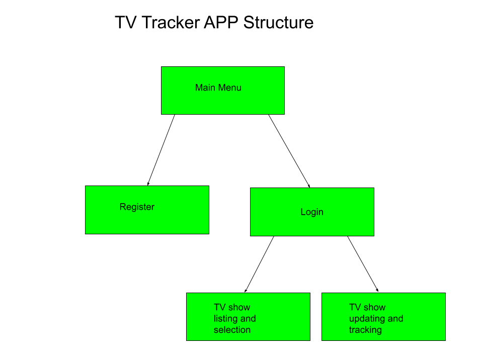
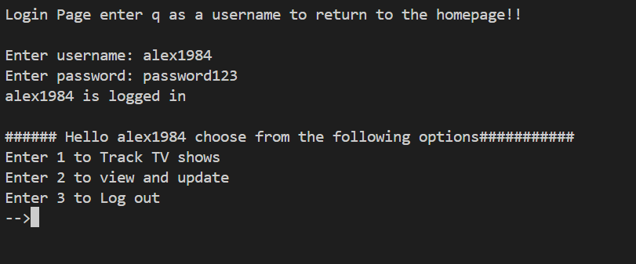
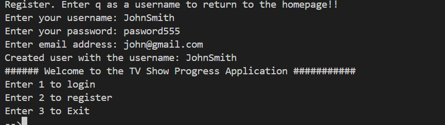
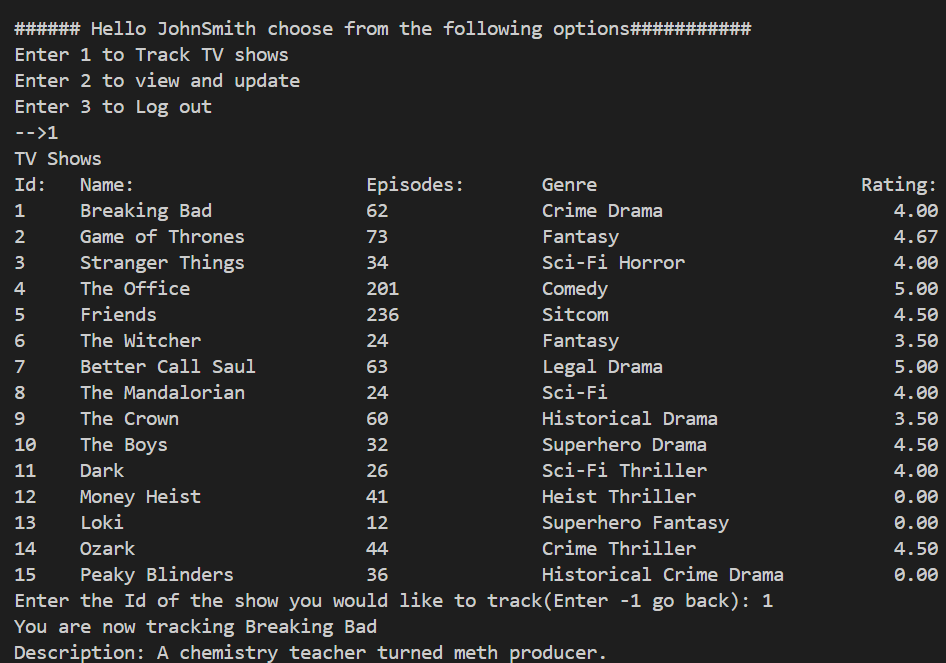
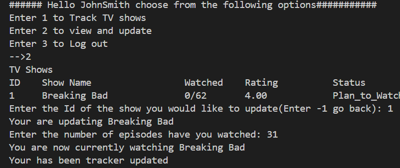
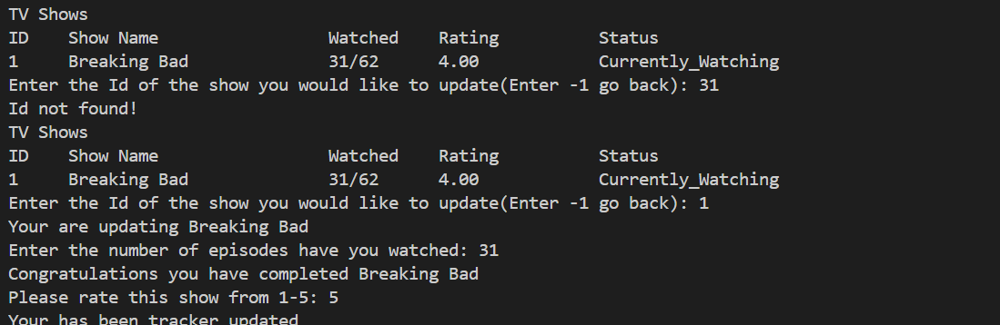
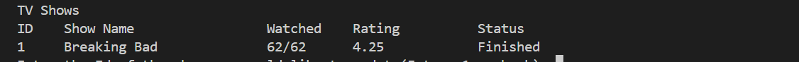

# 📺 TV Show Tracker

A Java terminal-based application that allows users to register, log in, and track their TV show watching progress. The application displays whether a user is planning to watch, currently watching, or has finished watching a show.

---

## ✨ Features

- User registration and login system
- Browse a list of available TV shows
- Add shows to your personal tracking list
- Update the number of episodes you've watched
- Track your progress and show status
- Persistent data using JDBC and MySQL
- Fully menu-driven interface via the terminal

---

## 🛠️ Technologies Used

- **Java SE**
- **JDBC (Java Database Connectivity)**
- **MySQL**
- **Maven**

---

## 🧑‍💻 How It Works

1. **User Registration/Login**  
   Users can create an account or log into an existing one.

2. **Main Menu Options**

   - View available shows and choose ones to track.
   - See your currently tracked shows.
   - Update the number of episodes watched.
   - View how many episodes have been watched out of the show's total.
   - View status: _Watching_, _Plan to Watch_, or _Finished_ (based on episode progress).

3. **Show Tracking Logic**
   - A show is marked as **Finished** when the number of watched episodes equals the total, after which the user can rate the show.
   - A show can be rewatched and will then be marked as **Currently Watching**.
   - All interactions are handled through the Java console.

---

## ⚙️ Setup Instructions

1. **Configure MySQL**

   - Create the database using the `.sql` scripts provided in the repository.
   - Update the database credentials in your Java code:
     ```java
     String url = "jdbc:mysql://localhost:3306/your_database";
     String username = "your_username";
     String password = "your_password";
     ```

2. **Compile and Run**
   ```bash
   javac -cp .:mysql-connector-java.jar Main.java
   java -cp .:mysql-connector-java.jar Main
   ```
   > Replace `:` with `;` on Windows.

---

## 📂 Project Structure



---

## 🖼️ Screenshots

### 🧭 Main Menu

  
Gives the user three options:  
1 - Login  
2 - Register  
3 - Exit the program

---

### 🔐 Login and Registration

#### Login

  
Enter your username and password to log in.

#### Register

  
Enter a unique username and a password with more than 7 characters.

---

### 📺 Show List and Tracking

  
View the list of available shows. Enter the corresponding show ID to begin tracking it.

---

### 🔄 Update Episodes Watched

#### Tracked Shows

  
View your tracked shows and choose one to update the number of episodes watched.

#### Current Show

  
Displays your progress. The status changes to "Currently Watching" once you’ve started the show. When finished, you can rate it.

#### Finished Show

  
Displays when a show is marked as finished and rated by the user.

---

## 🚧 Future Improvements

- Add password encryption
- Integrate a GUI (e.g., JavaFX or Swing)
- API integration for auto-fetching TV show data

---

## 👤 Author

- **Alexander Wade**  
  [GitHub](https://github.com/wadea1984)  
  Email: wadea1984@gmail.com

---
